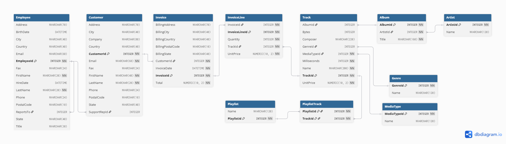

# Data Warehouse — DSI310

## Project Overview

This project analyzes the Chinook and Northwind SQLite databases as source systems for a future unified analytical data warehouse. Chinook represents digital music sales, while Northwind represents food, beverage, and other product sales.

The current repository documents the completed exploratory analysis of both source systems. It establishes a metadata-driven view of their schemas, keys, relationships, volumes, shared business entities, and sales processes before source-to-target mapping and warehouse design begin.

## Data Sources

### Chinook

Chinook is a digital music store database containing entities such as customers, invoices, invoice lines, tracks, albums, artists, genres, and employees.

### Northwind

Northwind is a sales database containing entities such as customers, orders, order details, products, categories, suppliers, employees, and shippers.

SQLite internal tables are reported separately and excluded from business-schema analysis.

## Current Progress

| Assignment Area | Status |
| --- | --- |
| Task 1.1 — Exploratory Data Analysis | ✅ Complete |
| Task 1.2 — Source-to-Target Mapping | ⏳ Next |
| Task 2 — Unified Star Schema | ⏳ Planned |
| Task 3 — Fact Row & Dashboard Mockup | ⏳ Planned |
| Task 4 — Design Discussion | ⏳ Planned |

## Task 1.1 — Exploratory Data Analysis

The completed exploratory work includes:

- Programmatic source database download and connection
- SQLAlchemy-based schema inspection
- Business-table, column, datatype, primary-key, and foreign-key inventories
- Record counts for all business tables and data-volume visualizations
- Chinook and Northwind source database schema diagrams
- Common business-entity comparison and common sales-process analysis

Metadata is derived from the actual SQLite schemas rather than manually hard-coded.

## Source Database Schema Diagrams

Source metadata is inspected programmatically with SQLAlchemy, and DBML files are generated from that metadata. dbdiagram.io is used to render and arrange the final visual layout, while the SQLite schemas remain the source of truth.

### Chinook



### Northwind


## Repository Structure

```text
Data-Warehouse-DSI310/
├── README.md
├── docs/
│   ├── dbml/
│   │   ├── chinook.dbml
│   │   └── northwind.dbml
│   └── diagrams/
│       ├── chinook_database_schema.png
│       ├── chinook_database_schema.svg
│       ├── northwind_database_schema.png
│       └── northwind_database_schema.svg
└── notebooks/
    ├── dsi310_northwind_chinook_eda_v1_0.ipynb
    └── original/
        └── dsi310_northwind_chinook_eda_v1_0 (original).ipynb
```

## Running the EDA Notebook

Open `notebooks/dsi310_northwind_chinook_eda_v1_0.ipynb` in Jupyter or VS Code, then install the notebook dependencies if needed:

```bash
pip install pandas sqlalchemy requests matplotlib
```

The notebook downloads the source SQLite databases automatically into a local
`data` directory when needed. When run from the notebook directory, these files
are stored under `notebooks/data/`, which is excluded from Git.

## Generated Schema Artifacts

- `docs/dbml/chinook.dbml` and `docs/dbml/northwind.dbml` are reproducible DBML schema definitions generated from inspected metadata.
- PNG database schema diagrams provide convenient notebook and repository views.
- SVG database schema diagrams provide vector versions for high-quality viewing.

## Next Step

Task 1.2 — Source-to-Target Mapping will document how fields from Chinook and Northwind map, transform, or combine for the future unified warehouse design. The mapping decisions themselves have not yet been defined.
