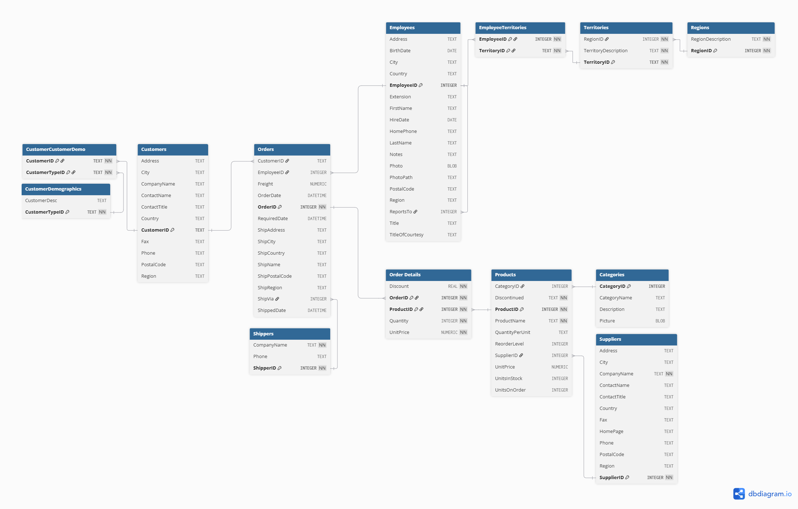
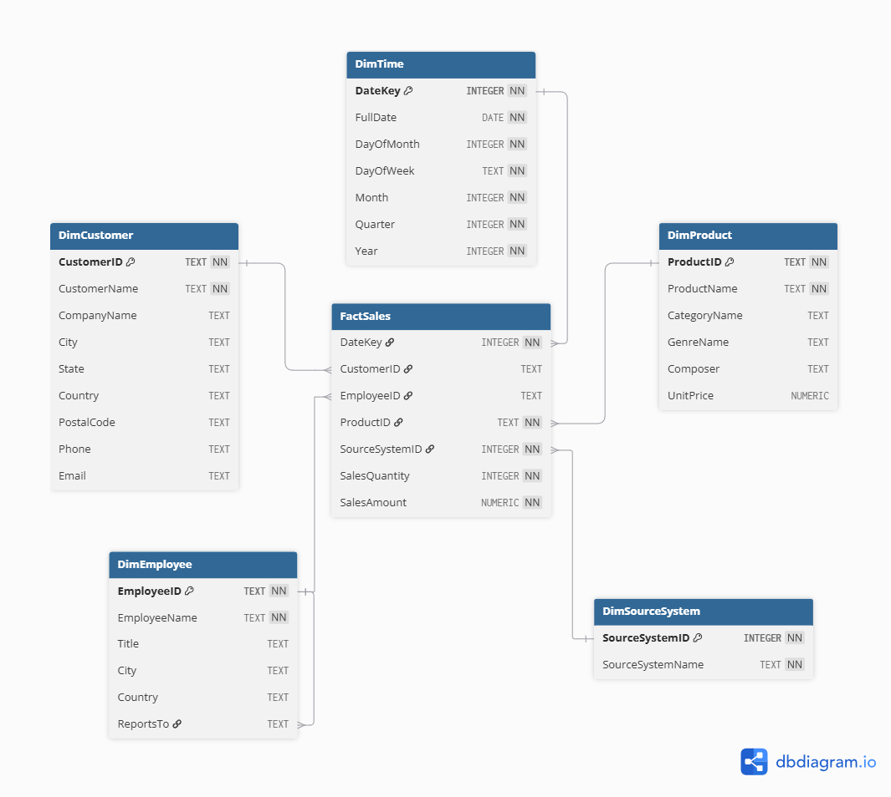

# Data Warehouse : DSI310

Unified analytical data warehouse design for Chinook and Northwind.

## Project Overview

OmniCorp has acquired two businesses represented by separate SQLite databases: Chinook, a digital music store, and Northwind, a food, beverage, and product-sales business. Their schemas were designed independently, so equivalent business concepts use different table names, structures, datatypes, identifiers, and relationships.

This project analyzes both source systems and designs one unified analytical Data Warehouse. The model supports business intelligence questions such as:

- How does revenue compare between the music and food/product businesses?
- Who are the top customers by total spend?
- Which products or tracks are the top sellers?
- How does sales performance vary by employee?
- How do sales vary over time and by source system?

The repository covers source understanding, Source-to-Target Mapping, dimensional modeling, a business-readable fact-row expression, a BI report mock-up, and data engineering design considerations. It defines the analytical model and its transformation contracts; it does not implement a complete production ETL platform or production Data Lake.

## Data Sources

### Chinook

Chinook represents digital music sales. Its relevant sales path is:

```text
Customer -> Invoice -> InvoiceLine -> Track -> Genre
```

`InvoiceLine` contains the line quantity, unit price, and track reference. The `Invoice` header provides the customer and transaction date. Chinook invoices do not contain a direct employee identifier. Employee context is derived through:

```text
Customer.SupportRepId -> Employee.EmployeeId
```

This relationship identifies the customer's assigned support representative, not a salesperson recorded directly on an invoice.

### Northwind

Northwind represents food, beverage, and other product sales. Its relevant sales path is:

```text
Customers -> Orders -> Order Details -> Products -> Categories
```

`Order Details` contains the line quantity, unit price, discount, and product reference. The `Orders` header provides the customer, employee, and transaction date. Northwind employee attribution is direct:

```text
Orders.EmployeeID -> Employees.EmployeeID
```

Task 1 inspects both SQLite schemas programmatically, including their tables, columns, datatypes, keys, relationships, and record counts. The inspected SQLite metadata remains the source of truth for source-schema documentation.

## Assignment Deliverables

### Task 1 : Data Understanding & Source-to-Target Mapping

#### Exploratory Data Analysis (EDA)

The [EDA notebook](notebooks/dsi310_northwind_chinook_eda_v1_0.ipynb) downloads and connects to both SQLite databases, then generates metadata inventories and visual summaries. It examines:

- business tables and columns
- source datatypes
- record counts and data volume
- primary keys and foreign-key relationships
- common business entities
- common sales processes and source-specific differences

The two source visuals are documented as **Database Schema Diagrams (Task 1 class-diagram output)**. They show source tables, columns, datatypes, primary keys, foreign keys, and table relationships. DBML definitions are generated from inspected metadata, while dbdiagram.io is used only to render and arrange the final diagrams.

#### Database Schema Diagrams (Task 1 Class-Diagram Output)

<table>
  <tr>
    <th>Chinook</th>
    <th>Northwind</th>
  </tr>
  <tr>
    <td>
      <a href="docs/task1/diagrams/chinook_database_schema.png">
        
      </a>
    </td>
    <td>
      <a href="docs/task1/diagrams/northwind_database_schema.png">
        
      </a>
    </td>
  </tr>
</table>

- [Chinook source DBML](docs/task1/chinook.dbml)
- [Northwind source DBML](docs/task1/northwind.dbml)

#### Source-to-Target Mapping

The mapping integrates source fields into `DimCustomer`, `DimEmployee`, `DimProduct`, `DimTime`, `DimSourceSystem`, and `FactSales`. Important transformations include:

- Chinook integer customer IDs and Northwind text customer IDs become source-prefixed canonical `TEXT` identifiers such as `CHINOOK:<id>` and `NORTHWIND:<id>`.
- Chinook `Track` and Northwind `Products` both map to `DimProduct`.
- Chinook music classification maps to `GenreName`; Northwind product classification maps to `CategoryName`.
- Attributes that a source cannot provide remain `NULL` rather than receiving fabricated values.
- Source-specific joins preserve the different customer, employee, product, date, and transaction structures.

The complete mapping is available as an [Excel workbook](docs/task1/source_to_target_mapping.xlsx) and [CSV file](docs/task1/source_to_target_mapping.csv).

### Task 2 : Dimensional Modeling & Schema Design

The warehouse uses a unified Kimball Star Schema with `FactSales` at the center and five directly related, conformed dimensions. The declared grain is:

> One row per sales transaction line item.

This means one Chinook `InvoiceLine` row or one Northwind `Order Details` row becomes one fact row.

`FactSales` contains exactly seven columns:

| Column | Role |
| --- | --- |
| `DateKey` | Foreign key to `DimTime` |
| `CustomerID` | Source-prefixed customer foreign key |
| `EmployeeID` | Nullable source-prefixed employee foreign key |
| `ProductID` | Source-prefixed product foreign key |
| `SourceSystemID` | Foreign key identifying Chinook or Northwind |
| `SalesQuantity` | Additive measure copied from source `Quantity` |
| `SalesAmount` | Additive measure calculated as `UnitPrice * Quantity` |

Northwind `Discount` is intentionally not included in the assignment-defined `SalesAmount`. Applying it to only one source would give the unified measure inconsistent meanings.

The dimensions are `DimCustomer`, `DimEmployee`, `DimProduct`, `DimTime`, and `DimSourceSystem`. `DimTime` uses an integer `DateKey` in `YYYYMMDD` form and supplies shared calendar attributes for both businesses.

A star schema was selected because each dimension relates directly to `FactSales`, reducing join complexity for BI queries. The conformed dimensions provide shared analytical views across the two businesses while the single line-item grain preserves product-level detail.

Detailed Task 2 artifacts:

- [Dimensional model specification](docs/task2/DIMENSIONAL_MODEL.md)
- [Dimensional modeling workbook (assignment template)](docs/task2/data_lake_design.xlsx)
- [Unified star-schema DBML](docs/task2/unified_star_schema.dbml)
- [Unified star-schema SVG](docs/task2/diagrams/unified_star_schema.svg)

#### Unified Star Schema



`FactSales` is the central fact table. Each dimension connects directly to it, and `DimEmployee.ReportsTo` preserves the employee hierarchy through a self-reference.

### Task 3 : Data Expression & Business Value

#### Fact Table Row Expression

The accepted example begins with Northwind order `10248`, product `11`, customer `VINET` (Paul Henriot), employee `5` (Steven Buchanan), transaction date `2016-07-04`, and product Queso Cabrales. The source line has quantity `12` and unit price `14.00`, producing `SalesAmount = 168.00`.

Its warehouse representation is:

| FactSales column | Value |
| --- | --- |
| `DateKey` | `20160704` |
| `CustomerID` | `NORTHWIND:VINET` |
| `EmployeeID` | `NORTHWIND:5` |
| `ProductID` | `NORTHWIND:11` |
| `SourceSystemID` | `2` |
| `SalesQuantity` | `12` |
| `SalesAmount` | `168.00` |

> On July 4, 2016, one Northwind sales line item recorded customer Paul Henriot purchasing 12 units of Queso Cabrales for a SalesAmount of 168.00, with the order attributed directly to Sales Manager Steven Buchanan.

See the complete [Fact Table Row Expression](docs/task3/FACT_ROW_INTERPRETATION.md) for its source fields, dimension context, and interpretation notes.

#### Report Mock-up (BI Dashboard)

The report asks: **How does total revenue compare between the Chinook music business and the Northwind food & beverage business?** It uses `SUM(FactSales.SalesAmount)` grouped by `DimSourceSystem.SourceSystemName`.

| Source system | Total SalesAmount | Share of combined |
| --- | ---: | ---: |
| Chinook | 2,328.60 | 0.0005% |
| Northwind | 448,475,298.72 | 99.9995% |
| **Combined** | **448,477,627.32** | **100.0000%** |

No currency is stated because the source data and current warehouse design do not establish a unified reporting currency. The large difference reflects the inspected datasets' transaction volumes and date coverage and should not automatically be interpreted as normalized real-world business performance.


See the [Report Mock-up documentation](docs/task3/BI_DASHBOARD_MOCKUP.md) for the analytical path and source-to-warehouse traceability. An interactive Streamlit version of this report is available by running `app.py` (see [Running the Streamlit App](#running-the-streamlit-app) below); it reproduces the same figures shown above and covers all six business questions from the dimensional model.

### Task 4 : Critical Thinking & Data Engineering Challenges

#### Data Ingestion & Integration

The main integration challenges are datatype differences, source-local identifier collisions, structural and naming differences, missing attributes, employee-attribution semantics, consistent measures, data-quality validation, and provenance. For example, Chinook `Customer.CustomerId` is `INTEGER`, while Northwind `Customers.CustomerID` is `TEXT`; both are normalized to target `TEXT` and prefixed by source. `DimSourceSystem` preserves the business origin of each fact.

#### Schema Evolution

If a third acquisition records the same sales process at the same line-item grain, its data should extend the existing `FactSales` and conformed dimensions through a new Source-to-Target Mapping. A conceptual source member `3 = ThirdCompany` and namespace `THIRDCOMPANY:<source id>` would preserve provenance and key uniqueness. A different business process or grain may require a separate fact table instead. This is an evolution strategy, not a claim that a third company currently exists.

#### Data Lake vs. Data Warehouse

A Data Lake provides flexible raw or source-aligned retention for ingestion, exploration, lineage, and reprocessing. The Data Warehouse publishes curated, standardized facts and dimensions for repeatable BI and governed metrics.

```text
Source Systems -> Data Lake / source-aligned storage -> validation + standardization + semantic mapping -> Data Warehouse -> BI / reporting
```

The current repository designs the warehouse analytical layer and its mappings, not a production Data Lake. See the [complete Task 4 discussion](docs/task4/TASK4_CRITICAL_THINKING.md) for details.

## Key Design Decisions

| Decision | Design |
| --- | --- |
| Identifier strategy | Source-prefixed canonical `TEXT` IDs: `CHINOOK:<id>` and `NORTHWIND:<id>` |
| Missing attributes | Preserve unavailable source attributes as `NULL` rather than inventing values |
| Employee attribution | Northwind uses direct order attribution; Chinook uses the customer's assigned support representative |
| Source provenance | Every fact references `DimSourceSystem` so Chinook and Northwind remain distinguishable |
| Measure consistency | `SalesAmount = UnitPrice * Quantity`; Northwind `Discount` is excluded from the assignment-defined measure |

## Repository Structure

```text
Data-Warehouse-DSI310/
├── README.md
├── requirements.txt
├── app.py
├── app/
│   ├── __init__.py
│   ├── data_loader.py
│   ├── model.py
│   ├── queries.py
│   └── validation.py
├── notebooks/
│   ├── dsi310_northwind_chinook_eda_v1_0.ipynb
│   └── original/
│       └── dsi310_northwind_chinook_eda_v1_0 (original).ipynb
└── docs/
    ├── task1/
    │   ├── chinook.dbml
    │   ├── northwind.dbml
    │   ├── source_to_target_mapping.csv
    │   ├── source_to_target_mapping.xlsx
    │   └── diagrams/
    │       ├── chinook_database_schema.png
    │       ├── chinook_database_schema.svg
    │       ├── northwind_database_schema.png
    │       └── northwind_database_schema.svg
    ├── task2/
    │   ├── DIMENSIONAL_MODEL.md
    │   ├── data_lake_design.xlsx
    │   ├── unified_star_schema.dbml
    │   └── diagrams/
    │       ├── unified_star_schema.png
    │       └── unified_star_schema.svg
    ├── task3/
    │   ├── FACT_ROW_INTERPRETATION.md
    │   ├── BI_DASHBOARD_MOCKUP.md
    │   └── bi_revenue_comparison_mockup.png
    └── task4/
        └── TASK4_CRITICAL_THINKING.md
```

## Running the EDA Notebook

Create and activate a repository-local virtual environment, then install the declared dependencies:

```powershell
python -m venv .venv
.\.venv\Scripts\Activate.ps1
pip install -r requirements.txt
```

Open `notebooks/dsi310_northwind_chinook_eda_v1_0.ipynb` in VS Code or a Jupyter interface and run the cells in order. The notebook downloads the source SQLite files into `notebooks/data/` when needed. That directory is excluded from Git.

## Running the Streamlit App

With the same virtual environment active and dependencies installed (see above), run:

```powershell
streamlit run app.py
```

The app downloads the same Chinook and Northwind SQLite files used by the EDA notebook into `notebooks/data/` on first run (skipped if already present), builds the unified `FactSales` fact table and its five conformed dimensions in memory, and serves an interactive version of the Task 3.2 BI dashboard covering all six business questions from the [dimensional model's BI coverage section](docs/task2/DIMENSIONAL_MODEL.md), plus an interactive version of the Task 3.1 fact-row interpretation. A validation badge on the Revenue tab confirms the app's computed totals match the figures documented in [BI_DASHBOARD_MOCKUP.md](docs/task3/BI_DASHBOARD_MOCKUP.md); the same check can be run standalone with `python -m app.validation`.

## Project Scope and Limitations

- This repository is a dimensional-modeling and analytical-design assignment; it does not deploy a production warehouse, ETL pipeline, or Data Lake platform.
- The source SQLite databases remain the source of truth for inspected source tables, columns, datatypes, primary keys, and foreign keys.
- Northwind `Discount` is intentionally excluded from the assignment-defined `SalesAmount`.
- Chinook employee attribution represents the customer's assigned support representative rather than a salesperson recorded on an invoice.
- The Task 3 report uses the provided datasets as inspected. Its results should not be treated as normalized real-company performance or as a currency comparison.
