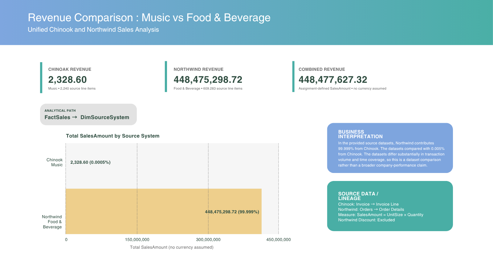

# Task 3.2 — Report Mock-up (BI Dashboard)

## Business Question

How does total revenue compare between the Chinook music business and the Northwind food & beverage business?

## Analytical Model

- Measure: `SUM(FactSales.SalesAmount)`
- Dimension: `DimSourceSystem.SourceSystemName`
- Grouping: Chinook versus Northwind

`FactSales` contains one row per sales transaction line item. `SalesAmount` is calculated as the source line `UnitPrice × Quantity`, and `DimSourceSystem` identifies whether each fact row originated from Chinook or Northwind.

## Source Data

| Business | Source system | Source tables | Revenue calculation |
|---|---|---|---|
| Music | Chinook | `Invoice`, `InvoiceLine` | `InvoiceLine.UnitPrice × InvoiceLine.Quantity` |
| Food & beverage | Northwind | `Orders`, `Order Details` | `Order Details.UnitPrice × Order Details.Quantity` |

The results were calculated directly from the local SQLite source databases. Northwind `Discount` is intentionally not applied, in accordance with the dimensional-model definition of `SalesAmount`. Freight and invoice header totals are not used as the revenue measure. As a source-data sanity check, the Chinook line calculation matches the sum of `Invoice.Total` at 2,328.60.

## Results

| Source system | Business | Total SalesAmount | Share of combined |
|---|---|---:|---:|
| Chinook | Music | 2,328.60 | 0.0005% |
| Northwind | Food & beverage | 448,475,298.72 | 99.9995% |
| **Combined** | **Both businesses** | **448,477,627.32** | **100.0000%** |

No currency symbol is shown because the source data and current warehouse design do not establish a unified reporting currency.

## Business Interpretation

Within the provided source datasets, Northwind contributes 99.9995% of combined revenue, compared with 0.0005% from Chinook. Northwind's calculated total is approximately 192,594.39 times Chinook's total. The datasets have substantially different transaction volumes and date coverage, so this comparison describes the supplied data rather than general company performance.

## Report / Dashboard Mock-up

## Source-to-Warehouse Traceability

- Chinook: `Invoice` → `InvoiceLine` → line `UnitPrice × Quantity` → `FactSales.SalesAmount`
- Northwind: `Orders` → `Order Details` → line `UnitPrice × Quantity` → `FactSales.SalesAmount`
- Dashboard analytical path: `FactSales` → `DimSourceSystem`, grouped by `DimSourceSystem.SourceSystemName`
- Northwind `Discount` is excluded from `SalesAmount`; it is retained only as source context.
